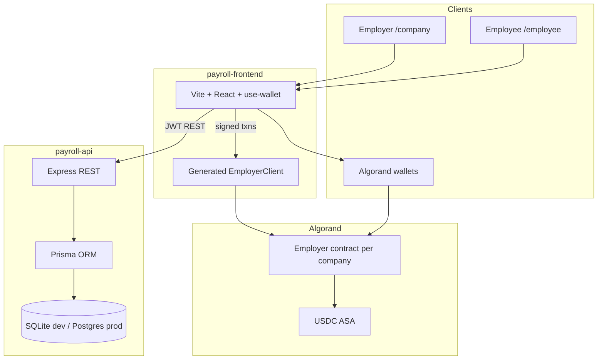

# PayRoll — system architecture

## Overview

PayRoll is a **hybrid payroll platform**: Algorand smart contracts settle USDC/ALGO salaries; an Express API stores people, KYC, payroll runs, tax estimates, and off-ramp state; a React app orchestrates employer and employee flows.

## Repositories / packages

| Package | Role | Tech |
|---------|------|------|
| `projects/payroll-contracts` | On-chain payroll engine | Algorand TypeScript (Puya), Vitest + LocalNet E2E |
| `projects/payroll-api` | Off-chain operations | Express, Prisma, JWT wallet auth |
| `projects/payroll-frontend` | UX for employer + employee | React, Vite, AlgoKit typed clients |

## Data boundaries

| Data | Where |
|------|--------|
| Salary, active flag, USDC/ALGO split | Contract box storage |
| KYC, invitations, payroll runs, payments, audit | API database |
| KYC file blobs | Pinata IPFS (or mock CID in dev) |

## Auth

- **API:** Challenge → sign 0 ALGO txn with note `zeril-auth:{nonce}` → JWT (`employer` \| `employee`).
- **Chain:** Only `employer` global state address can `payEmployee`, `addEmployee`, etc.

## x402 (demo)

Optional **HTTP 402** routes under `/api/x402/*` for metered premium resources. Core payroll APIs are unchanged and use JWT auth.

## Deployment (target)

| Component | Host |
|-----------|------|
| Frontend | [Vercel](https://vercel.com) — `projects/payroll-frontend` |
| API | [Render](https://render.com) — `projects/payroll-api` |
| Database | Render PostgreSQL |
| Contracts | AlgoKit → TestNet/MainNet (GitHub Actions) |

Full guide: [DEPLOYMENT.md](./DEPLOYMENT.md) · Blueprint: [`render.yaml`](../render.yaml) at repo root.

## Scaling notes (10× users)

- **Per-company contract** — tenant isolation on-chain.
- **Stateless API** + Postgres + job queue for off-ramp.
- **Challenge store** → Redis when running multiple API instances.
- **Static frontend** on CDN.

See [SECURITY.md](./SECURITY.md) for known limitations.
