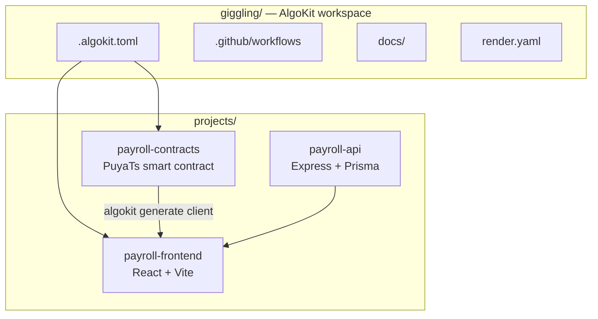
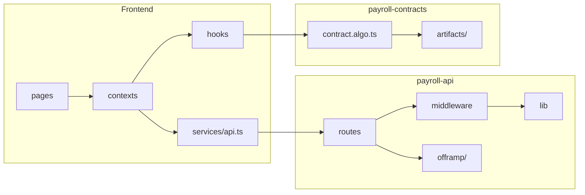

# Code quality & repository structure

## Monorepo layout



```
giggling/
├── .algokit.toml                 # Workspace: build contracts + frontend
├── .github/workflows/            # CI per package + validate on PR
├── docs/                         # Architecture, security, deployment, panel guides
├── render.yaml                   # Render blueprint (API)
└── projects/
    ├── payroll-contracts/
    │   ├── smart_contracts/
    │   │   ├── employer/         # contract.algo.ts, *.spec.ts, deploy-config.ts
    │   │   ├── artifacts/        # Compiled TEAL + ARC-56 (generated)
    │   │   └── index.ts          # Deploy entry
    │   └── .algokit.toml         # Contract build, test, TEAL audit
    │
    ├── payroll-api/
    │   ├── prisma/               # Schema + migrations
    │   └── src/
    │       ├── app.ts            # Express app (testable)
    │       ├── index.ts          # Server bootstrap
    │       ├── auth/             # JWT, challenges, address normalize
    │       ├── middleware/       # requireAuth, requireCompanyAdmin
    │       ├── routes/           # One router per domain
    │       ├── lib/              # tax, pinata, saberAuth, cors
    │       ├── offramp/          # orchestrator + clients
    │       └── *.test.ts         # Vitest + Supertest
    │
    └── payroll-frontend/
        └── src/
            ├── pages/            # /company, /employee, landing
            ├── layouts/            # CompanyLayout, EmployeeLayout
            ├── components/       # Feature UI (Employee, Payroll, landing)
            ├── contexts/         # PayrollContext, EmployeeContext
            ├── hooks/            # usePayrollContract, useEmployees
            ├── auth/             # walletAuth, AuthBootstrapper
            ├── services/api.ts   # Typed REST client
            └── contracts/        # Generated EmployerClient
```

---

## Design principles

| Principle | How it shows up |
|-----------|-----------------|
| **Separation of concerns** | Chain = contracts; people/policy = API; UX = frontend |
| **Domain-driven routes** | API: `kyc.ts`, `payrollRuns.ts`, `invitations.ts`, not one giant file |
| **Generated clients** | AlgoKit compiles contract → typed `EmployerClient` in frontend |
| **Explicit auth layers** | Middleware composes `requireAuth` + `requireCompanyAdmin` + `requireSelfAddress` |
| **Testable API** | `app.ts` exports Express app; tests use Supertest without listening |
| **Migrations as code** | Prisma migrations version DB schema |

---

## Code quality tooling

| Package | Lint / format | Type-check | Tests | CI |
|---------|---------------|------------|-------|-----|
| **payroll-contracts** | ESLint + Prettier | `tsc --noEmit` | Vitest + LocalNet E2E | ✅ |
| **payroll-api** | — | `tsc` + `tsconfig.test.json` | Vitest (10 tests) | ✅ |
| **payroll-frontend** | ESLint (max-warnings 0) | Vite + TS | Jest + Playwright stub | ✅ |

Shared: `.editorconfig` (2 spaces, LF, single quotes, 140 cols).

---

## Layer responsibilities



---

## Conventions

- **TypeScript everywhere** — strict mode on API; ESM (`"type": "module"`).
- **Import paths** — API uses `.js` extensions for ESM emit compatibility.
- **Algorand addresses** — normalized in `auth/addresses.ts` (case-safe).
- **Env config** — `.env.example` per service; secrets never committed.
- **Employer vs employee** — separate routes (`/company/*`, `/employee/*`) and JWT roles.

---

## Strengths (for judges)

1. **Clear three-tier monorepo** aligned with hybrid payroll architecture.
2. **AlgoKit-standard contract layout** with artifacts and deploy scripts.
3. **Composable API middleware** — easy to explain who can call what.
4. **Single frontend API module** (`services/api.ts`) with typed responses.
5. **CI gates on every PR** — contracts, API, frontend.
6. **Documentation folder** — architecture, security, deployment, panel guides.

---

## Honest gaps & roadmap

| Gap | Impact | Plan |
|-----|--------|------|
| API has no ESLint yet | Style drift | Add `@typescript-eslint` to payroll-api |
| `api.ts` is large (~700 lines) | Harder navigation | Split by domain when time allows |
| `.algokit.toml` build omits API | API built separately | Documented; CI covers API |
| Frontend test coverage thin | Few unit tests | Critical paths covered by contract E2E |
| Some route files are long (`kyc.ts`) | Review burden | Extract helpers, keep routes thin |

---

## Panel script (30 sec)

> “We use an **AlgoKit workspace monorepo** with three packages: **contracts** compile to TEAL and generate typed clients; **payroll-api** is Express with domain routers, Prisma migrations, and composable auth middleware; **frontend** is React with employer and employee layouts, a central API client, and PayrollContext for on-chain + off-chain orchestration. **CI** runs lint and tests on contracts and frontend, type-check and tests on the API. Structure mirrors our trust boundaries: chain for money, API for people and compliance, UI for workflows.”

See also: [ARCHITECTURE.md](./ARCHITECTURE.md), [TECHNICAL_PANEL.md](./TECHNICAL_PANEL.md).
