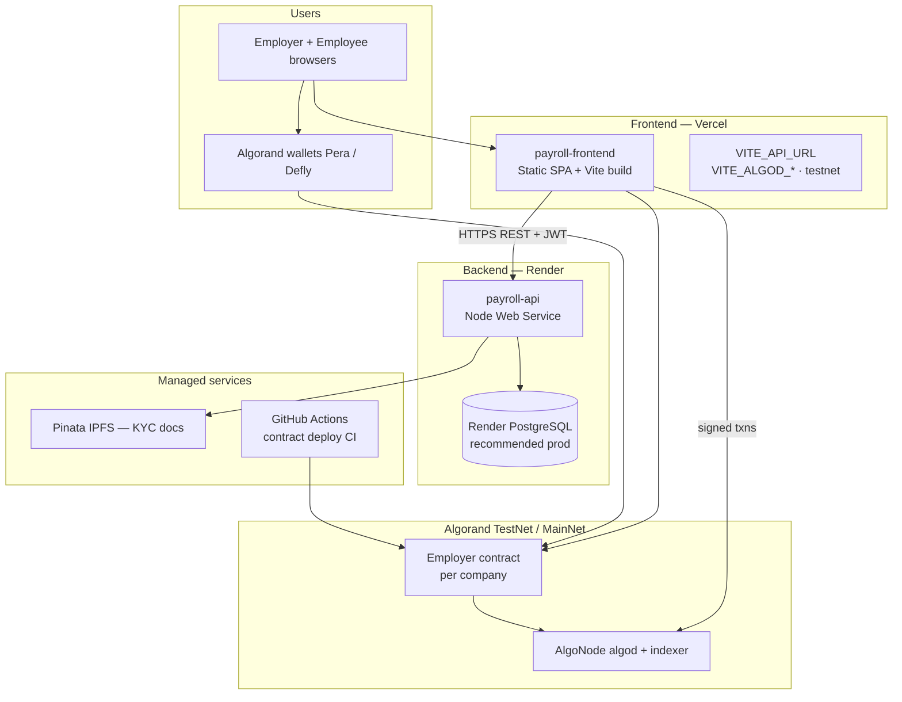
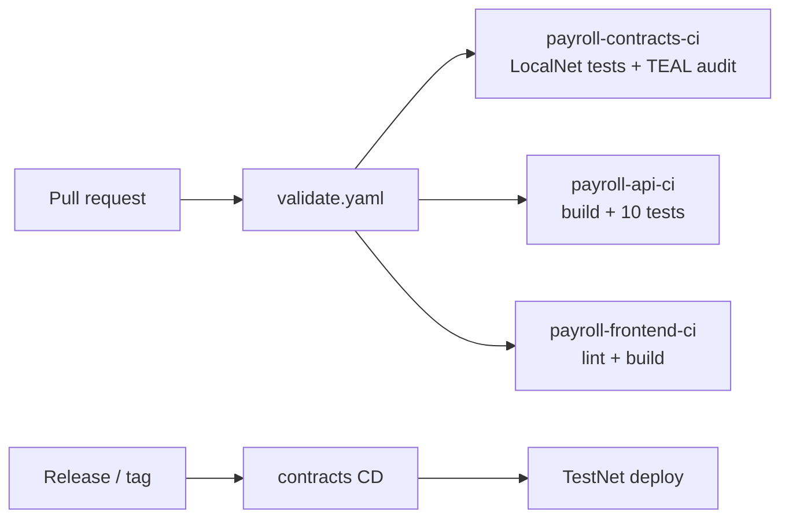

# PayRoll — deployment & infrastructure (Render backend)

## Production topology



---

## Component map

| Layer | Host | Repo path | Purpose |
|-------|------|-----------|---------|
| **Frontend** | [Vercel](https://vercel.com) | `projects/payroll-frontend` | React UI, wallet connect, contract calls |
| **Backend API** | [Render](https://render.com) | `projects/payroll-api` | KYC, payroll runs, auth, tax, off-ramp |
| **Database** | Render PostgreSQL | — | Persistent company/employee/payment data |
| **Smart contracts** | Algorand chain | `projects/payroll-contracts` | USDC payroll settlement |
| **Contract CI/CD** | GitHub Actions | `.github/workflows/payroll-contracts-cd.yaml` | TestNet deploy on release |
| **App CI** | GitHub Actions | `.github/workflows/validate.yaml` | Lint, test, build on every PR |

---

## Render — backend (`payroll-api`)

### Why Render

- Long-running **Express** process (not a fit for pure serverless).
- **PostgreSQL** add-on for durable Prisma data.
- Health checks on `/api/health`.
- Free tier suitable for demos; paid tier for always-on production.

### Option A — Blueprint (fastest)

1. Push repo to GitHub.
2. Render Dashboard → **New** → **Blueprint**.
3. Point at repo; Render reads `render.yaml` at repo root.
4. Set secret env vars in dashboard (Pinata, Saber, `FRONTEND_ORIGIN`).
5. After deploy, copy service URL → Vercel `VITE_API_URL`.

### Option B — Manual Web Service

| Setting | Value |
|---------|--------|
| **Root directory** | `projects/payroll-api` |
| **Runtime** | Node |
| **Build command** | `npm ci && npm run render:build` |
| **Start command** | `npm run render:start` |
| **Health check path** | `/api/health` |

Link a **Render PostgreSQL** instance and set `DATABASE_URL` from the connection string.

### Environment variables (Render dashboard)

| Variable | Required | Notes |
|----------|----------|--------|
| `DATABASE_URL` | Yes (prod) | From Render Postgres **Internal** URL |
| `JWT_SECRET` | Yes | Long random string (`openssl rand -hex 32`) |
| `FRONTEND_ORIGIN` | Yes | Your Vercel URL, e.g. `https://payroll.vercel.app` |
| `NODE_ENV` | Yes | `production` |
| `PORT` | Auto | Render sets this; app reads `process.env.PORT` |
| `PINATA_JWT` or `PINATA_API_KEY` + `PINATA_SECRET_KEY` | For real KYC uploads | Mock CID if unset |
| `SABER_*` | Optional | Real off-ramp when integrated |
| `X402_DEV_BYPASS` | Optional | `false` in production |

### Database: local vs Render

| Environment | Database | Prisma |
|-------------|----------|--------|
| **Local dev** | SQLite `file:./prisma/dev.db` | `provider = "sqlite"` in `schema.prisma` |
| **Render prod** | PostgreSQL | One-time: set `provider = "postgresql"`, then `npx prisma db push` against Render `DATABASE_URL` |

SQLite on Render’s ephemeral disk **resets on redeploy** — use **PostgreSQL** for anything beyond a health-check demo.

### Verify backend

```bash
curl https://YOUR-SERVICE.onrender.com/api/health
# {"status":"ok","timestamp":"..."}
```

---

## Vercel — frontend (`payroll-frontend`)

| Setting | Value |
|---------|--------|
| **Root directory** | `projects/payroll-frontend` |
| **Build** | `npm run build` |
| **Output** | `dist` |

**Environment variables (TestNet example):**

| Variable | Example |
|----------|---------|
| `VITE_API_URL` | `https://YOUR-SERVICE.onrender.com` |
| `VITE_ALGOD_SERVER` | `https://testnet-api.algonode.cloud` |
| `VITE_ALGOD_NETWORK` | `testnet` |
| `VITE_INDEXER_SERVER` | `https://testnet-idx.algonode.cloud` |

Do **not** set KMD vars on Vercel (LocalNet only). `vercel.json` handles SPA routing.

After deploy, set Render `FRONTEND_ORIGIN` to your Vercel URL so CORS allows browser requests.

---

## Smart contracts — Algorand

Contracts are **not** deployed to Render or Vercel.

```bash
# Local
algokit localnet start
algokit project deploy localnet --project-name payroll-contracts

# TestNet (CI or manual)
algokit project deploy testnet --project-name payroll-contracts
# Requires DEPLOYER_MNEMONIC in env / GitHub secrets
```

Employers can also deploy from the app **Settings** page with a connected wallet.

---

## CI/CD pipeline



---

## 10× users (infrastructure answer)

| Bottleneck | Scale strategy |
|------------|----------------|
| API traffic | Horizontal Render instances (stateless Express) |
| Database | Render Postgres → connection pooling (PgBouncer) |
| Auth challenges | Redis with TTL (today: in-memory) |
| Off-ramp jobs | Background queue (BullMQ / Render cron worker) |
| Frontend | Vercel CDN — no scale concern |
| On-chain | One **Employer app per company** — sharded by tenant |

---

## Panel talking points (30 seconds)

> “Frontend is a static Vite app on **Vercel**. Backend is **Express on Render** with **PostgreSQL** for Prisma — payroll runs, KYC metadata, and audit logs. **Algorand contracts** deploy via **GitHub Actions** to TestNet; settlement stays on-chain, API never holds employer keys. **CI** runs contract E2E, TEAL audit, and API tests on every PR. CORS is locked to our Vercel origin via `FRONTEND_ORIGIN`.”

---

## Troubleshooting

| Issue | Fix |
|-------|-----|
| CORS error from Vercel | Set `FRONTEND_ORIGIN` on Render to exact Vercel URL |
| 401 on KYC approve | Employer JWT + company `adminAddress` in Settings |
| DB empty after Render redeploy | You used SQLite on ephemeral disk → switch to Postgres |
| Cold start slow (free tier) | First request after idle ~30s; use paid plan or ping health |

See also: [ARCHITECTURE.md](./ARCHITECTURE.md), [SECURITY.md](./SECURITY.md), [TECHNICAL_PANEL.md](./TECHNICAL_PANEL.md).
